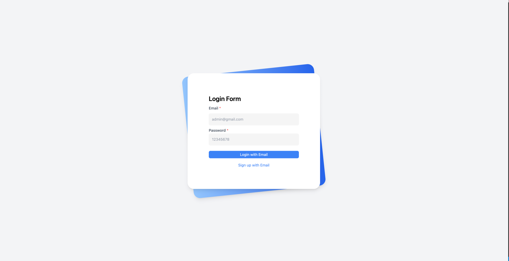

### [demo link](https://nextjs-recipe-repo.vercel.app/)

<br/>
<p align="center">

</p>

## Table of Contents

- [Recipe UI](#search-ui)
  - [Table of Contents](#table-of-contents)
  - [Installation](#installation)
  - [Usage](#usage)

## Installation

To install the project, you'll need to have Node.js and Yarn installed on your machine. Once you have those installed, follow these steps:

1. Clone the repository:

   ```
   git clone https://github.com/shwepyihein/nextjs-recipe-repo.git
   ```

2. Install the dependencies:

   ```
   cd  nextjs-recipe-repo
    yarn install
   ```

3. setup the envrionment:
   Add Envrionment for Api end point

   ```
   cd recipe-frontend
   touch .env
   ```

   ```
   NEXT_PUBLIC_API_URL=
   ```

## Usage

To start the development server, you need to setup postgres db url first and then run the following command:

```
yarn start
```

To start client project, you need to go to client folder and then run commend:

```
yarn dev
```

## Deploy on Vercel

The easiest way to deploy your Next.js app is to use the [Vercel Platform](https://vercel.com/new?utm_medium=default-template&filter=next.js&utm_source=create-next-app&utm_campaign=create-next-app-readme) from the creators of Next.js.

Check out our [Next.js deployment documentation](https://nextjs.org/docs/deployment) for more details.
